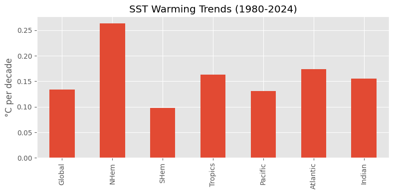
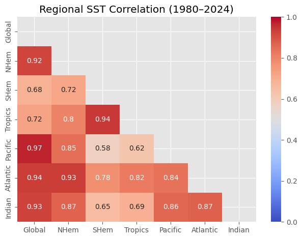
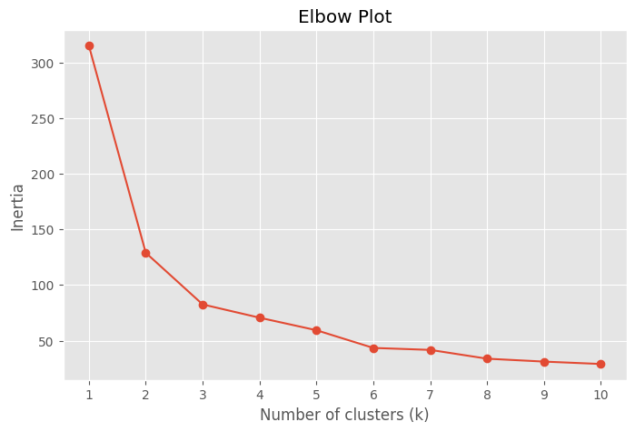
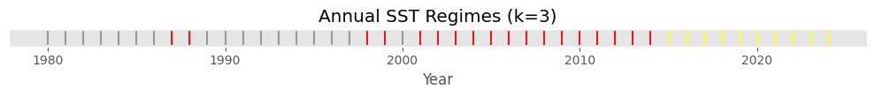
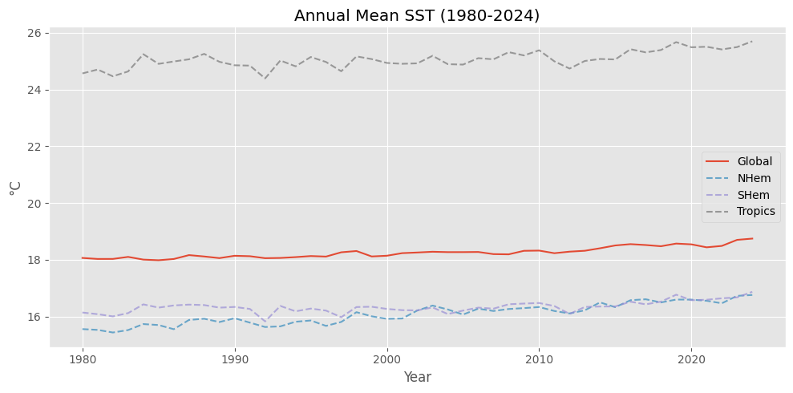

# Sea‑Surface Temperature Trends & Regional Patterns (ERSST v6)



---

## Project Overview
This repository contains an end‑to‑end data‑science workflow that analyses the **NOAA Extended Reconstructed Sea‑Surface Temperature v6 (ERSST v6)** dataset for the period **1980 – 2024**.  

All results are reproducible with the included `analysis.ipynb` notebook.

---

## Directory Structure
```
.
├── data
│   ├── raw/                 
│   └── processed/           
├── env
│   ├── environment.yaml     
│   └── requirements.txt     
├── analysis.ipynb           
├── figs/
└── README.md
```

---

## 1) Downloading Raw Data
ERSST v6 monthly means are freely available from NOAA‑PSL:

```bash
mkdir -p data/raw
wget -P data/raw \
  https://downloads.psl.noaa.gov/Datasets/noaa.ersst.v6/sst.mnmean.nc
```

*If NOAA updates the file, simply redownload; the notebook will handle the new tail years automatically.*

---

## 2) Processed Data Outputs
Running the notebook creates three CSVs in **`data/processed/`**:

| File | Description | Key Columns |
|------|-------------|-------------|
| `sst_means.csv` | Annual, area‑weighted SST (°C) for 7 predefined regions, 1854‑2024. | `year`, `Global`, `NHem`, `SHem`, `Tropics`, `Pacific`, `Atlantic`, `Indian` |
| `sst_clusters.csv` | Same as above but restricted to 1985‑2024 with an extra `cluster` label (0 – 2) from $k$‑means. | _above_ + `cluster` |
| `sst_trends.csv` | Linear‑trend slopes (°C / decade) for each region. | `region`, `°C/decade` |

---

## 3) Environment Setup
Clone the repo and create the conda environment:

```bash
conda env create -f env/environment.yaml
conda activate sea-surface-temps
pip install -r env/requirements.txt
```

The YAML provides **Python 3.12**, _xarray_, _pandas_, _matplotlib_, _scikit‑learn_, etc.; `requirements.txt` covers any additional PyPI utilities.

---

## 4) Running the Analysis
1. Ensure the raw NetCDF file sits in `data/raw/` (or edit `ERSST_PATH` at the top of the notebook).  
2. Launch Jupyter Lab or Notebook:
   ```bash
   jupyter lab  # or jupyter notebook
   ```
3. Open **`analysis.ipynb`**, select **Kernel ▸ Restart & Run All**.  
4. CSVs and updated PNGs will appear in `data/processed/` and `data/figs/`.

---

## 5) Key Figures
Below are the main visuals generated by `analysis.ipynb`.

### SST Warming Trends (1980‑2024)


### Regional SST Correlation Matrix


### Elbow Plot – Choosing _k_ for K‑Means


### Annual SST Regimes Timeline (k = 3)


### Annual Mean SST Time‑Series


---

## 8 · License
Source code is released under the MIT License.  Data remain under NOAA public‑domain terms.
